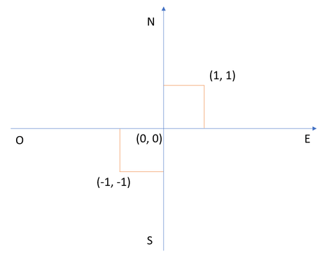

# Pokemon: Catch'Em All - apanhá-los todos


## Pokemon World Model

It is a two-dimensional, which is represented by two axis: S-N and O-E.



## Movement encoding

* `N` move ` = (+1, 0)`;
* `S` move ` = (-1, 0)`;
* `E` move ` = (0, +1)`;
* `O` move ` = (0, -1)`;

## Requirements

Tested with **Python 3.8** and **python3-venv**. Run the following commands
in order to install the requirements:

```bash
$ python3 -m venv venv
$ . venv/bin/activate
$ pip install -U pip && pip install -r requirements.txt
```

## Running

To execute a simple movement, e.g. `"NESO"`, run the following command:

```bash
$ python src/main.py NESO
4
```
It returns the number of captured Pokemons. For more info, use the `-h` switch.

## Running tests

```bash
$ pytest src/tests src/tests/test_pokemontrainer.py
```
